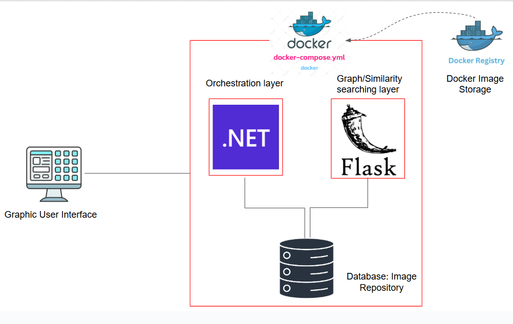
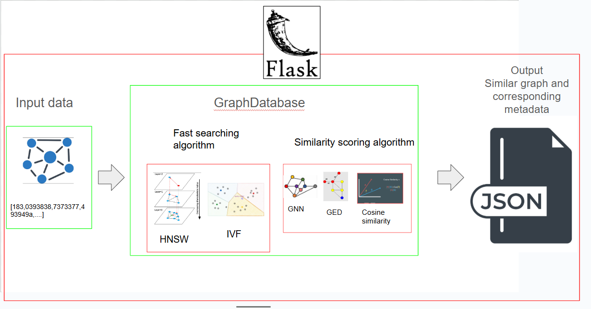

# 🔍 GraphSearch: Advanced Graph-Based Vector Searching Tool


GraphSearch is a high-performance engine designed to find patterns within complex, interconnected data that combines graph similarity algorithms with fast approximate nearest neighbor search. This system enables storing, searching, and managing graph-structured data with efficient  performance.


## Overview


This project implements a hybrid graph database system that provides:
- **Graph Data Management (CRUD):** A digital filing system for "webs" of data. It allows you to create, view, update, and delete complex maps of information
- **Vector/ Graph Similarity Searching:** Integrated similarity search using AI-driven or rule based graph embeddings.
- **Multiple Similarity Algorithms:** This provides different "lenses" for the AI. You can choose to focus on the big-picture structure (Graph2Vec), specific patterns (GNN), or the tiny details of every single connection (Graph Edit Distance).
- **Flexible Backends:** High-speed search capabilities via HNSW or IVF.
- **RESTful API:** A universal plug that allows other software and websites to talk to this system easily.

## 🏗 Architecture

<p align="center">
  
</p>

<p align="center">
  
</p>

## 🛠 Tech Stack


### Backend - .NET (C#)
- **Purpose**: Handles the core "Business Logic," security, and API management
- **Language**: C# (net9.0)
- **SDK Version**: .NET 9.0.307
- **Framework**: ASP.NET Core Web API
- **Key Dependencies**:
  - Paseto.Core 1.4.1 (Token-based authentication)
  - xUnit (Testing framework)


### Backend - Python (Flask)
- **Purpose**: ML/AI services for graph embeddings and similarity computation
- **Language**: Python 3.12.3
- **Framework**: Flask (planned/in development)


### CI/CD
- **GitHub Actions**: Automated testing after push


## Documentation


- [GraphSearch Design Document](Backend/Dotnet/Design.md) - Search graph management design
- [GraphSearch Architecture](Backend/Dotnet/archtecture.md) - System architecture and MVP design
- [Error Handling](Backend/Dotnet/Errors/README.md) - Error handling patterns


## Prerequisites


### For .NET Development
- .NET SDK 9.0 or later
- A C# IDE (Visual Studio, VS Code, Rider)


### For Python Development
- Python 3.12 or later
- pip (Python package manager)


### For Docker (Optional)
- Docker Desktop or Docker Engine
- docker-compose


## Getting Started


### 1. Clone the Repository
```bash
git clone <repository-url>
cd GraphDatabase
```


### 2. Run the .NET API


#### Build and Run
```bash
cd Backend/Dotnet
dotnet restore
dotnet build
dotnet run
```


The API will start on `http://localhost:5000` (or `https://localhost:5001` for HTTPS).


#### Run Tests
```bash
# From repository root
dotnet test Backend/Dotnet.Test/Dotnet.Test.csproj


# With detailed output
dotnet test Backend/Dotnet.Test/Dotnet.Test.csproj --logger "console;verbosity=detailed"


# Generate TRX test results
dotnet test Backend/Dotnet.Test/Dotnet.Test.csproj --logger trx --results-directory test-results
```


### 3. Run the Flask Service (Coming Soon)


```bash
cd Backend/flaskr
pip install -r requirements.txt
flask run
```


### 4. Using Docker (Planned)


```bash
docker-compose up --build
```


## Configuration


### .NET Application Settings
Configuration is managed through `appsettings.json` and `appsettings.Development.json` files in `Backend/Dotnet/`.


Key configuration areas:
- **Authentication**: Token schemes and policies
- **Algorithms**: Similarity and search algorithm selection
  - Similarity types: GNN, GED, Graph2Vec
  - Search indexes: HNSW, IVF, Flat (exact)
- **Error handling**: Problem details options


Example algorithm configuration: (Details below are user changable)
```json
{
  "Algorithms": {
    "Similarity": { "Type": "SimGNN", -- User changable option
    "ModelPath": "models/simgnn.onnx" },
    "Embedding": { "Type": "GraphSAGE", "Dim": 256 }, -- User changable option
    "Index": {
      "Type": "HNSW", -- User changable option
      "HNSW": { "M": 32, "EfConstruction": 200, "EfSearch": 64 }
    }
  }
}
```


## Testing and Error Handling


#### Error Handling
Centralized error handling at `Backend/Dotnet/Common/Errors/`:
- Custom error types (ValidationFailedError, EntityNotFoundError, etc.)
- Problem details factory for consistent API responses
- See `Backend/Dotnet/Errors/README.md` for details


#### Testing
- **Framework**: xUnit
- **Test Project**: `Backend/Dotnet.Test/`
- **CI**: GitHub Actions runs tests automatically on push
- **Results**: TRX format uploaded as artifacts


